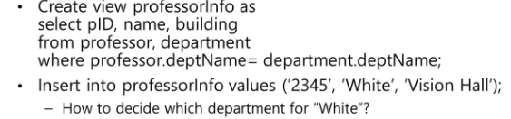

지금까지는 base relation
#####virtual relation은 테이블처럼 보이지만 값 존재하지 않음
버츄얼 정의할 때 베이스 쓰고, 실제 값은 베이스로 인서트
버츄얼 테이블 셀렉트, 뭐뭐 구문 다 가능
-> 데이터 보안의 목적

#1. virtual relation = view
사용자에게 정보를 숨기기 위해 사용

create view v as
select ~~ from..

select구문의 결과로 view 만드는 것
view에 tuple없음!!

다른 테이블로부터 유도되는 테이블임.

virtual | base
---|---
create table | create view
||as select를 통해 정의된 것임
데이터 물리적 존재|데이터 물리적으로 존재하진 않지만 up to date (최신임)

###up to date
base의 값이 수정되면 view도 자동으로 수정됨

###view using other view
뷰인 자신도 가능 -> recursive view

####view expansion
최종 view는 base를 가지고있어야함 (view가 없어야함)

####view modify
view와 base 컬럼 구성이 다를 때, view에 insert시 base의 컬럼 구성을 생각해서 해야함.
뷰에서 필요 없는 값은 null처리

두개 이상의 베이스 참조시 같은 이름의 튜플 존재한다면 뷰에서 인서트시에 명시해야함

####->updatable view
1. from절 하나의 테이블
2. distinct 안됨
3. select에 나오지 않은 베이스의 튜플은 null값을 가질 수 있어야함
4. group by having 이런거 안됨
등등..

join일떄 한 테이블만 고치는 형식이라면 updateble함

####with check option
deptname이 CS인 view에 deptname이 EE인 인서트를 한다면 updatble하지만 사용자에겐 보이지 않음. 베이스테이블에 넣기 때문에 조건문=cs에서 배제됨.
with check option 명시한다면 insert not allow

####view 제약
index, key, other constraint 불가

#2. Integrity Constraints (ICs)
DBMS가 항상 만족해야하는 조건
데이터에 대한 정확도를 제공하기 위해 사용
--> data valid

##single relation constraints
###not null
null 불가
###primary key
null 비허용
###unique
중복값 없음
null 허용
###chek (P), where P is a predicate
check (semester in ("Spring", "Summer", "Fall", "Winter))