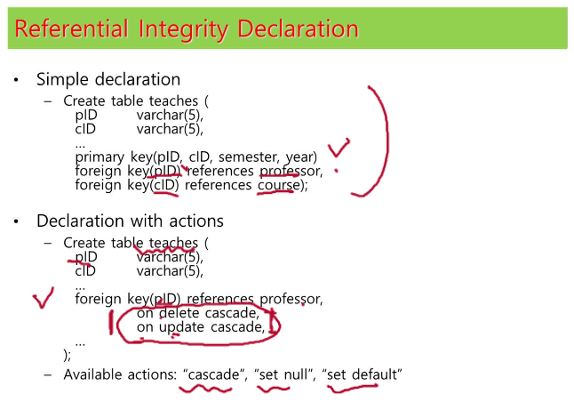

###Referential Intergiry Constraint
참조무결성..
외래키는 주키를 참조해야하며 주키에 없는거 인서트불가

professor table에서 update, delete가 일어나면 cascade하라..
보통은 professor에서 참조되고있는 값 delete못함
하지만 on delete cascade 옵션 명시시 professor에서 지워지고, 해당 주키를 참조하고있는 teaches의 튜플도 지워짐
cascade: 전파되다
set null: 삭제되면 null로 정의

###foreign key add
foreign key 먼저 insert
foreign key 일단 null
deferred ICs -> 일단 넣고, transition 끝날 때 매치

pID char(5) check (pID in (select pID from professor)) //처럼 서브질의 가능하지만 지원 별로 안하며 권장되지 않음
--> insert 할 떄마다 유효한지 검사해야하기때문...